---
## Front matter
lang: ru-RU
title: Презентация отчёта по лабораторной работе 1
author: 'Чистякова Ханна Ильинична'
date: 16 сентября, 2021

## Formatting
toc: false
slide_level: 2
theme: metropolis
mainfont: PT Serif
romanfont: PT Serif
sansfont: PT Sans
monofont: PT Mono
header-includes: 
 - \metroset{progressbar=frametitle,sectionpage=progressbar,numbering=fraction}
 - '\makeatletter'
 - '\beamer@ignorenonframefalse'
 - '\makeatother'
aspectratio: 43
section-titles: true
---

## Цель работы

Приобретение практических навыков установки операционной системы на виртуальную машину, настройки минимально необходимых для дальнейшей работы сервисов

## Задание

Установить на виртуальную машину VirtualBox (https://www.virtualbox.org/) операционную систему Linux, дистрибутив CentOS.

# Выполнение лабораторной работы

1.	Запустить _Virtual Box_, проверить месторасположение каталога для виртуальных машин (рис.1)

	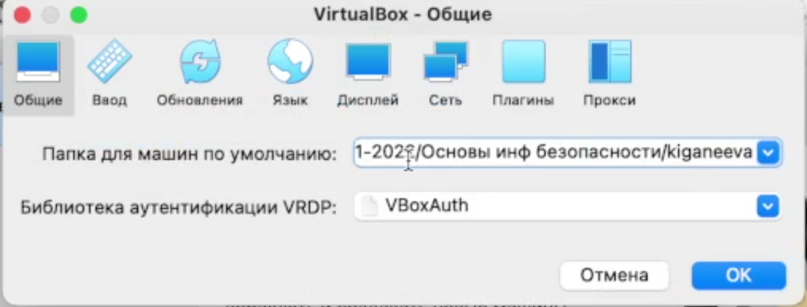{ #fig:001 width=50% }

---

2.	Создать новую виртуальную машину, задать ей имя _Base_, тип _Linux_, версию _Red Hat_, (рис. 2) размер основной памяти 1024мб (рис. 3), конфигурацию жесткого диска (динамический виртуальный жёсткий диск типа VDI) (рис. 4-5)и его размер – 20Гб.

	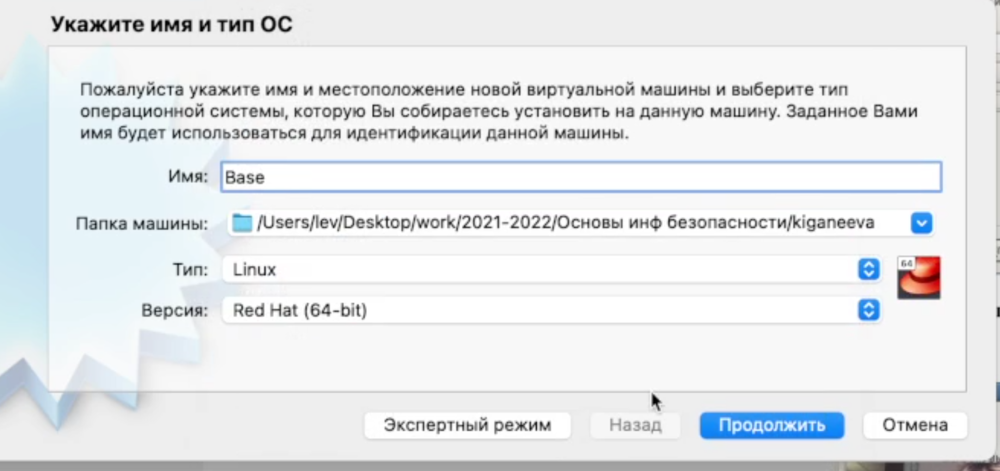{ #fig:002 width=50% }

---

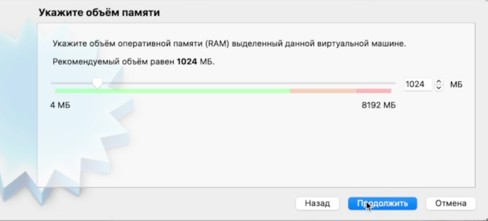{ #fig:003 width=50% }
	
---

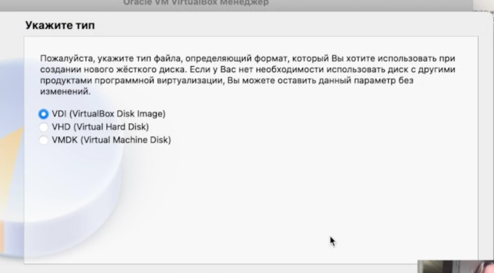{ #fig:004 width=50% }
	
---

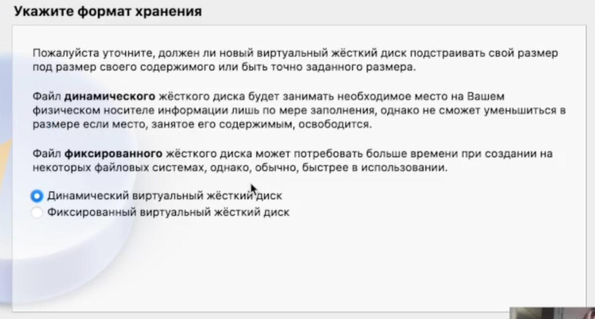{ #fig:005 width=50% }
	
---

3.	Проверить, что папка для снимков виртуальной машины имеет путь users/lev/desktop/work/2021-2022/Основы инф. Безопасности/kiganeeva/base/snapshots (рис. 6)

	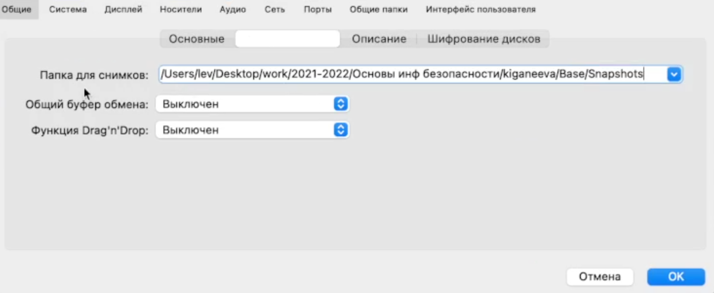{ #fig:006 width=50% }
	
---

4.	Добавить новый привод оптических дисков и выбрать образ (рис. 7)

	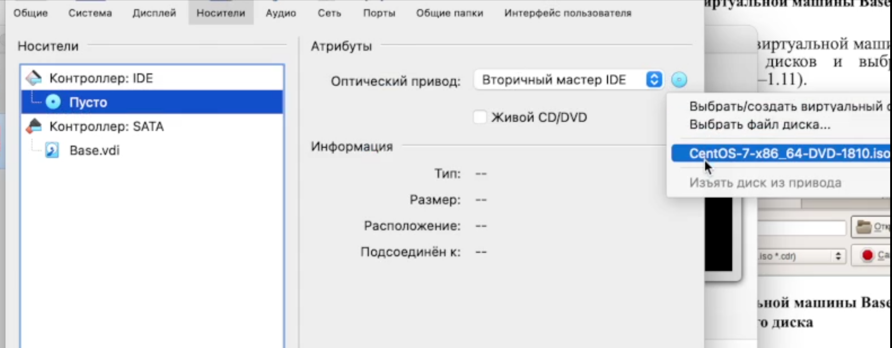{ #fig:007 width=50% }

---

5.	Запустить виртуальную машину и выставить все настройки – русский язык для интерфейса и раскладки клавиатуры (рис. 8), дату и время (рис. 9), имя сети и т.д. (рис. 10)

	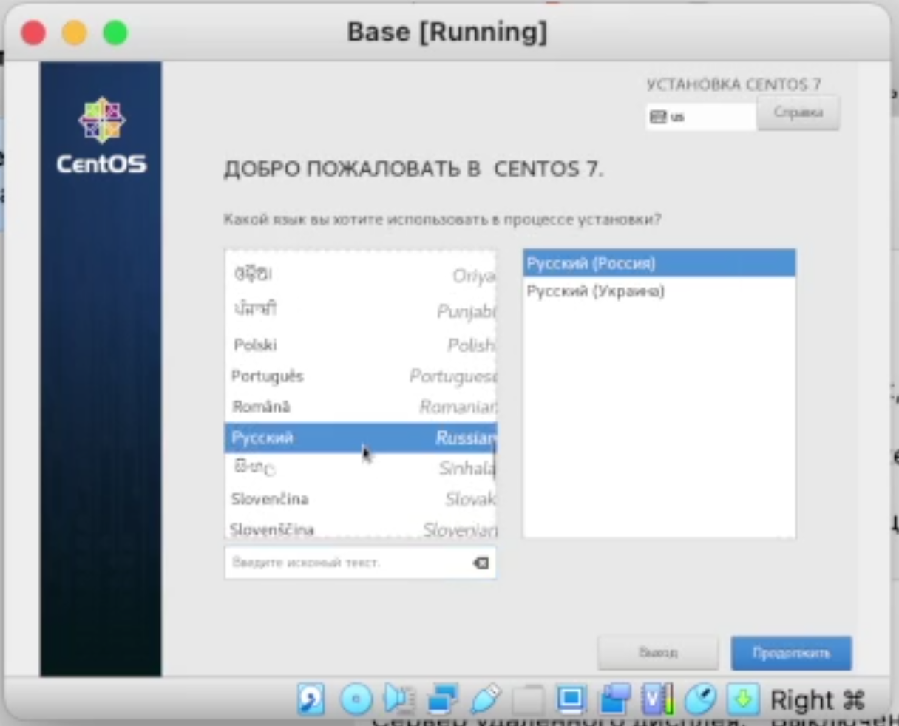{ #fig:008 width=50% }
	
---

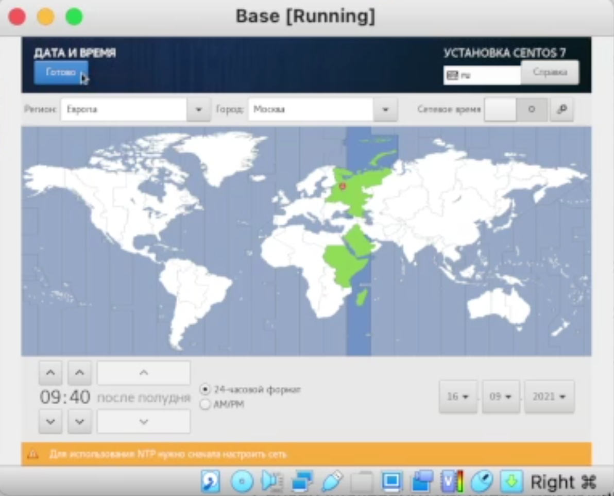{ #fig:009 width=50% }
	
---

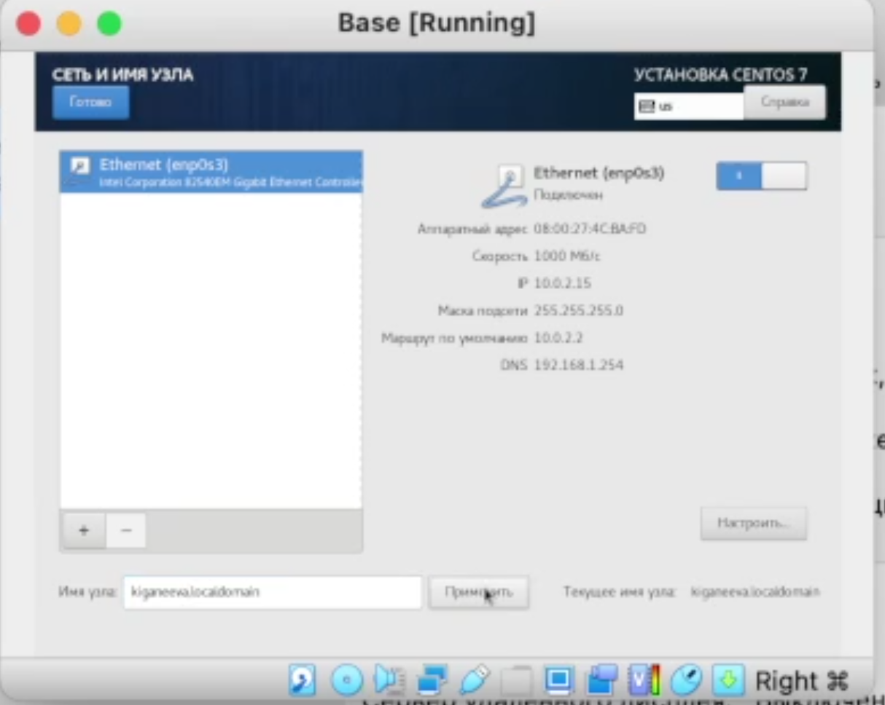{ #fig:010 width=50% }
	
---

7.	Установить пароль для root, создать нового пользователя (рис. 11) и завершить установку операционной системы

	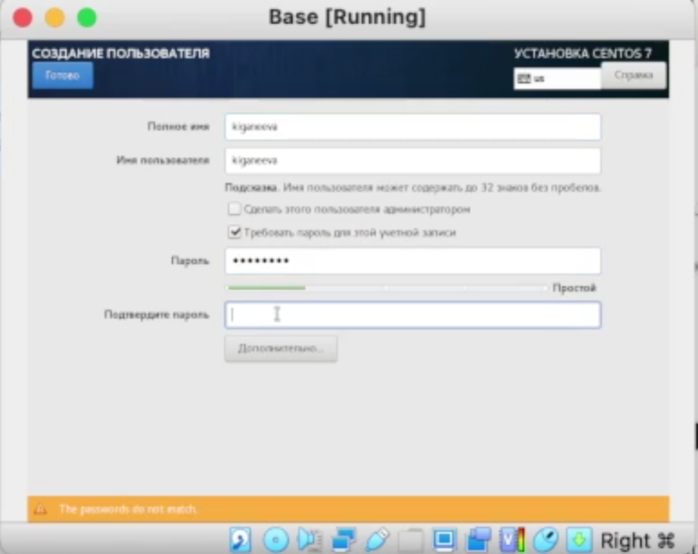{ #fig:011 width=50% }
	
---

8.	Подключиться к виртуальной машине с помощью созданной учетной записи (рис. 12)

	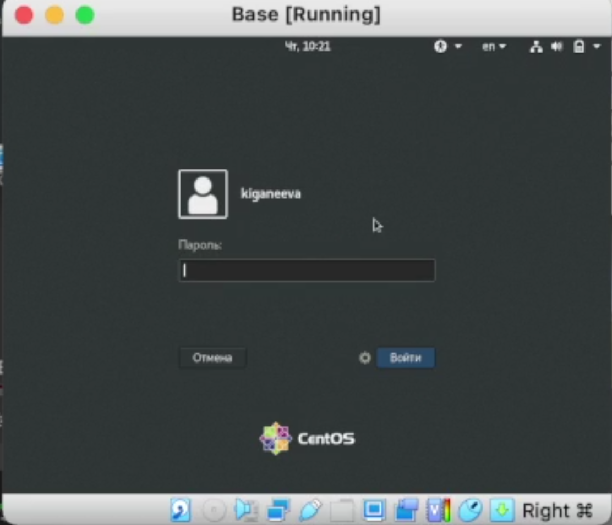{ #fig:012 width=50% }
	
---

9.	Запустить терминал, перейти под учетную запись root, обновить системные файлы (рис. 13) и Завершить работу виртуальной машины

	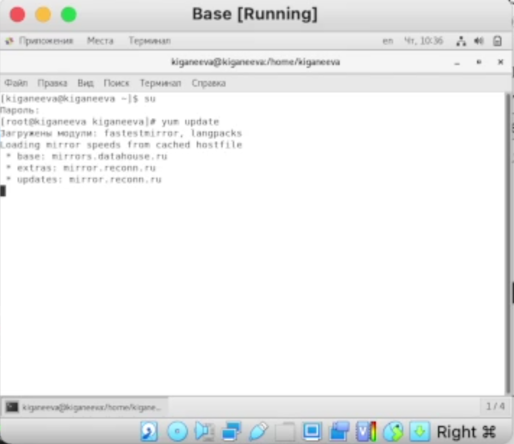{ #fig:013 width=50% }
	
---

11.	Создать машину Host 2 на основе виртуальной машины Base (рис. 14-15)

	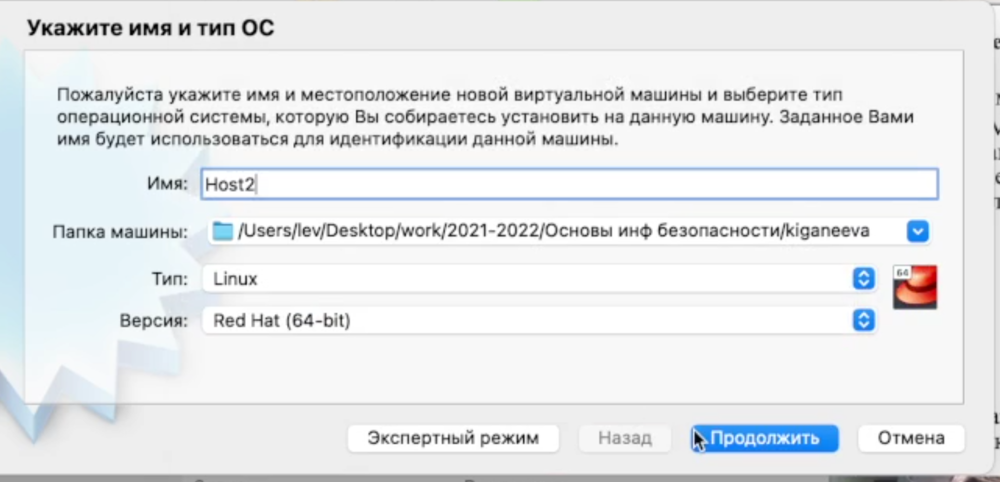{ #fig:014 width=50% }

---	

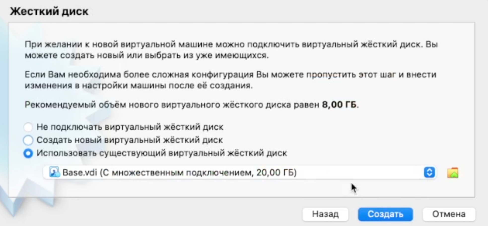{ #fig:015 width=50% }

# Выводы

Я научилась устанавливать операционную систему на виртуальную машину и настраивать минимально необходимые для дальнейшей работы сервисы

## {.standout}

Спасибо за внимание!
