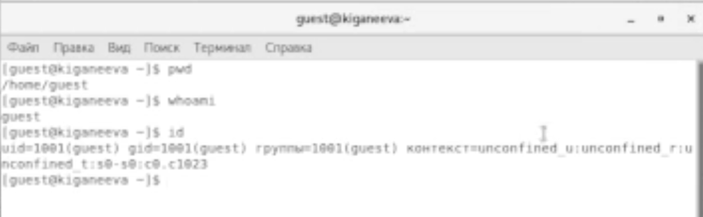

---
## Front matter
lang: ru-RU
title: Презентация отчёта по лабораторной работе 2
author: 'Чистякова Ханна Ильинична'
date: 30 сентября, 2021

## Formatting
toc: false
slide_level: 2
theme: metropolis
mainfont: PT Serif
romanfont: PT Serif
sansfont: PT Sans
monofont: PT Mono
header-includes: 
 - \metroset{progressbar=frametitle,sectionpage=progressbar,numbering=fraction}
 - '\makeatletter'
 - '\beamer@ignorenonframefalse'
 - '\makeatother'
aspectratio: 43
section-titles: true
---

## Цель работы

Получение практических навыков работы в консоли с атрибутами файлов, закрепление теоретических основ дискреционного разграничения доступа в современных системах с открытым кодом на базе ОС Linux .

# Выполнение лабораторной работы

1.	В установленной при выполнении предыдущей лабораторной работы
операционной системе создаем учётную запись пользователя guest с помощью команды useradd guest (рис. [-@fig:001])

{ #fig:001 width=70% }

---

2.	Задаем пароль для пользователя guest командой passwd guest (рис. [-@fig:002])

{ #fig:002 width=70% }

	
---

3.	Входим в систему от имени пользователя guest. (рис. [-@fig:003])

{ #fig:003 width=70% }
	
---

4.	Определяем директорию, в которой находимся, командой pwd. Она совпадает с приглашением командной строки и является домашней директорией. (рис. [-@fig:004])

{ #fig:004 width=70% }

---

5.	Уточняем имя пользователя командой whoami.(рис. [-@fig:005])

{ #fig:005 width=70% }

	
---

6.	Уточняем имя пользователя, его группу, а так же группы, куда входит пользователь, командой id. Выведенные значения uid, gid и др. запоминаем.  (рис. [-@fig:006])

{ #fig:006 width=70% }

Сравниваем вывод id с выводом команды groups. Т.к. команда groups выводит те группы, в которых состоит наш пользователь, в нашем случае эта команда вывела «guest». Можно сделать вывод, что эти команды выдают одинаковые значения.
	
---

7.	Просмотриваем файл /etc/passwd командой cat /etc/passwd (рис. [-@fig:007])

{ #fig:007 width=70% }
	
---

8.	Определяем существующие в системе директории командой ls -l /home/,  (рис. [-@fig:008])

{ #fig:008 width=70% }

guest и kiganeeva – это каталоги, о чём свидетельствует флаг «d». Для обоих каталогов – полные права (rwx).
	
---

9.	Проверяем, какие расширенные атрибуты установлены на поддиректориях, находящихся в директории /home, командой: lsattr /home (рис. [-@fig:009])

{ #fig:009 width=70% }

---	

10. Создаем в домашней директории поддиректорию dirl командой mkdir dirl (рис. [-@fig:0010])

{ #fig:0010 width=70% }

---

Определяем командами ls -l и lsattr, какие права доступа и расширенные атрибуты были выставлены на директорию dirl. (рис. [-@fig:0011])

{ #fig:0011 width=70% }

---

11. Снимаем с директории dirl все атрибуты командой chmod 000 dirl
и проверяем её правильность с помощью  выполнения команды ls -l. (рис. [-@fig:0012])

{ #fig:0012 width=70% }

Действительно, данная команда сняла все атрибуты с этой директории. Команда ls –l выполняется правильно.

---

12. Попытались создать в директории dirl файл file1 командой echo "test" > /home/guest/dir1/file1. Увидели, что выполнить данную команду нам не позволяет отсутствие для нас нужных прав. 

{ #fig:0013 width=70% }

---

13. Заполнили таблицу «Установленные права и разрешённые действия» (см. табл. 2.1), выполняя действия от имени владельца директории, определив опытным путём, какие операции разрешены, а какие нет. Если операция разрешена, заносили в таблицу знак «+», если не разрешена, знак «-».

{ #fig:0014 width=70% }

---

{ #fig:0015 width=70% }

---

14. На основании заполненной таблицы определили те или иные минимально необходимые права для выполнения операций внутри директории dir1, заполнили таблицу 2.2.  

{ #fig:0016 width=70% }

# Выводы

Я научилась устанавливать операционную систему на виртуальную машину и настраивать минимально необходимые для дальнейшей работы сервисы

## {.standout}

Спасибо за внимание!
