---
# Front matter
title: "Отчёт по лабораторной работе №2"
subtitle: "По дисциплине Основы информационной безопасности"
author: "Чистякова Ханна Ильинична "

# Generic otions
lang: ru-RU
toc-title: "Содержание"

# Bibliography
bibliography: bib/cite.bib
csl: pandoc/csl/gost-r-7-0-5-2008-numeric.csl

# Pdf output format
toc: true # Table of contents
toc_depth: 2
lof: true # List of figures
lot: true # List of tables
fontsize: 12pt
linestretch: 1.5
papersize: a4
documentclass: scrreprt
## I18n
polyglossia-lang:
  name: russian
  options:
	- spelling=modern
	- babelshorthands=true
polyglossia-otherlangs:
  name: english
### Fonts
mainfont: PT Serif
romanfont: PT Serif
sansfont: PT Sans
monofont: PT Mono
mainfontoptions: Ligatures=TeX
romanfontoptions: Ligatures=TeX
sansfontoptions: Ligatures=TeX,Scale=MatchLowercase
monofontoptions: Scale=MatchLowercase,Scale=0.9
## Biblatex
biblatex: true
biblio-style: "gost-numeric"
biblatexoptions:
  - parentracker=true
  - backend=biber
  - hyperref=auto
  - language=auto
  - autolang=other*
  - citestyle=gost-numeric
## Misc options
indent: true
header-includes:
  - \linepenalty=10 # the penalty added to the badness of each line within a paragraph (no associated penalty node) Increasing the value makes tex try to have fewer lines in the paragraph.
  - \interlinepenalty=0 # value of the penalty (node) added after each line of a paragraph.
  - \hyphenpenalty=50 # the penalty for line breaking at an automatically inserted hyphen
  - \exhyphenpenalty=50 # the penalty for line breaking at an explicit hyphen
  - \binoppenalty=700 # the penalty for breaking a line at a binary operator
  - \relpenalty=500 # the penalty for breaking a line at a relation
  - \clubpenalty=150 # extra penalty for breaking after first line of a paragraph
  - \widowpenalty=150 # extra penalty for breaking before last line of a paragraph
  - \displaywidowpenalty=50 # extra penalty for breaking before last line before a display math
  - \brokenpenalty=100 # extra penalty for page breaking after a hyphenated line
  - \predisplaypenalty=10000 # penalty for breaking before a display
  - \postdisplaypenalty=0 # penalty for breaking after a display
  - \floatingpenalty = 20000 # penalty for splitting an insertion (can only be split footnote in standard LaTeX)
  - \raggedbottom # or \flushbottom
  - \usepackage{float} # keep figures where there are in the text
  - \floatplacement{figure}{H} # keep figures where there are in the text
---

# Цель работы

Получение практических навыков работы в консоли с атрибутами файлов, закрепление теоретических основ дискреционного разграничения доступа в современных системах с открытым кодом на базе ОС Linux .

# Теоретическое введение

В табл. [-@tbl:std-dir] приведено краткое описание стандартных каталогов Unix.

: Описание некоторых каталогов файловой системы GNU Linux {#tbl:std-dir}

| Имя каталога | Описание каталога                                                                                                          |
|--------------|----------------------------------------------------------------------------------------------------------------------------|
| `/`          | Корневая директория, содержащая всю файловую                                                                               |
| `/bin `      | Основные системные утилиты, необходимые как в однопользовательском режиме, так и при обычной работе всем пользователям     |
| `/etc`       | Общесистемные конфигурационные файлы и файлы конфигурации установленных программ                                           |
| `/home`      | Содержит домашние директории пользователей, которые, в свою очередь, содержат персональные настройки и данные пользователя |
| `/media`     | Точки монтирования для сменных носителей                                                                                   |
| `/root`      | Домашняя директория пользователя  `root`                                                                                   |
| `/tmp`       | Временные файлы                                                                                                            |
| `/usr`       | Вторичная иерархия для данных пользователя                                                                                 |

Более подробно об Unix см. в [@gnu-doc:bash;@newham:2005:bash;@zarrelli:2017:bash;@robbins:2013:bash;@tannenbaum:arch-pc:ru;@tannenbaum:modern-os:ru].

# Выполнение лабораторной работы

1. В установленной при выполнении предыдущей лабораторной работы
операционной системе создаем учётную запись пользователя guest с помощью команды useradd guest (рис. [-@fig:001])

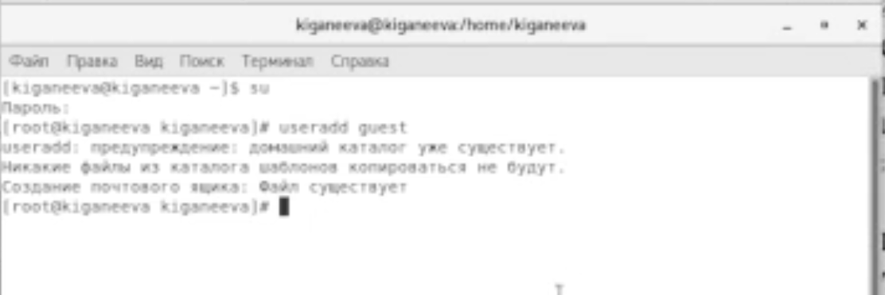{ #fig:001 width=70% }

2. Задаем пароль для пользователя guest командой passwd guest (рис. [-@fig:002])

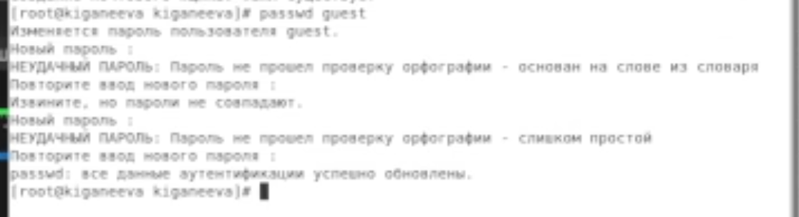{ #fig:002 width=70% }

3. Входим в систему от имени пользователя guest. (рис. [-@fig:003])

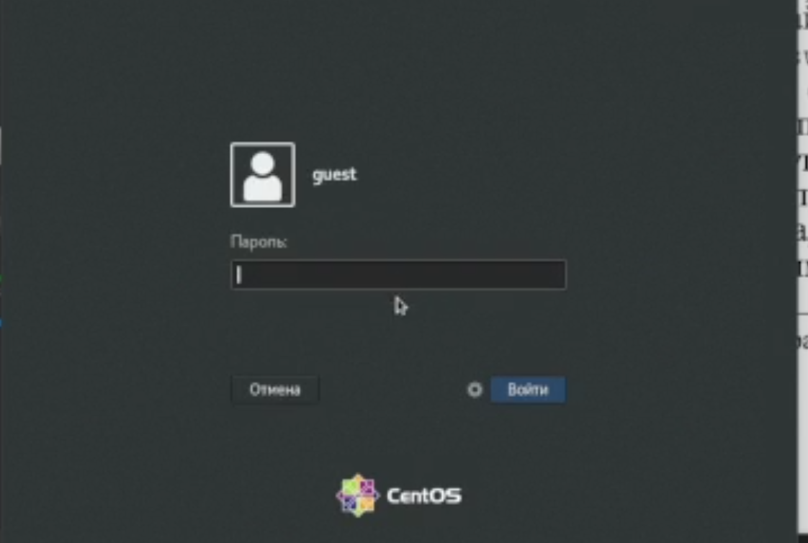{ #fig:003 width=70% }

4. Определяем директорию, в которой находимся, командой pwd. Она совпадает с приглашением командной строки и является домашней директорией. (рис. [-@fig:004])

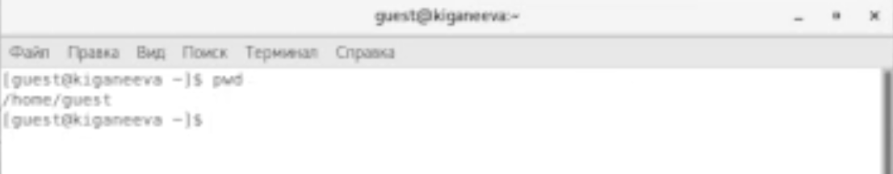{ #fig:004 width=70% }

5. Уточняем имя пользователя командой whoami.(рис. [-@fig:005])

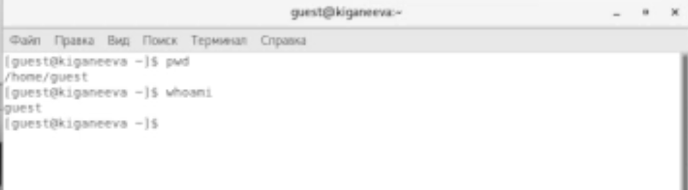{ #fig:005 width=70% }

6. Уточняем имя пользователя, его группу, а так же группы, куда входит пользователь, командой id. Выведенные значения uid, gid и др. запоминаем.  (рис. [-@fig:006])

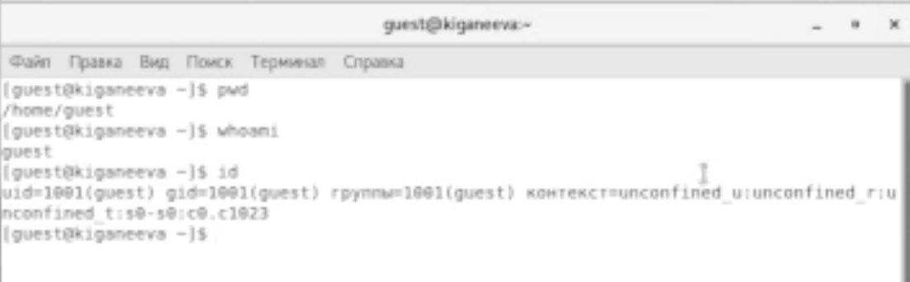{ #fig:006 width=70% }

Сравниваем вывод id с выводом команды groups. Т.к. команда groups выводит те группы, в которых состоит наш пользователь, в нашем случае эта команда вывела «guest». Можно сделать вывод, что эти команды выдают одинаковые значения.

7. Просмотриваем файл /etc/passwd командой cat /etc/passwd (рис. [-@fig:007])

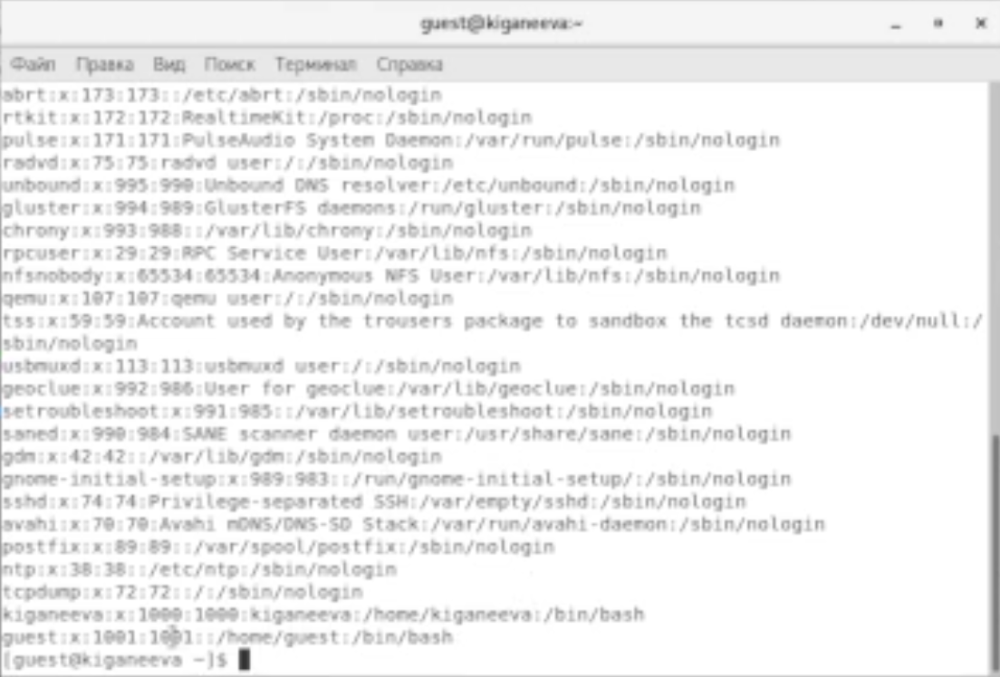{ #fig:007 width=70% }

uid и gid пользователя  - 1001 - совпадают со значениями, полученными в предыдущих пунктах.
guest: x: 1001:1001::/home/guest:/bin/bash

Из нашей учетной записи мы видим, что:
Guest – это User-Name;
x – Encrypted password entry;
1001 – User Id (uid);
1001 – Group Id (gid).

8. Определяем существующие в системе директории командой ls -l /home/,  (рис. [-@fig:008])

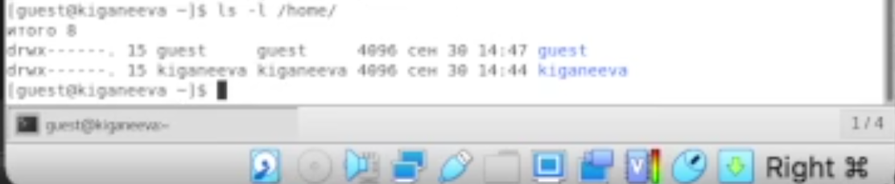{ #fig:008 width=70% }

guest и kiganeeva – это каталоги, о чём свидетельствует флаг «d». Для обоих каталогов – полные права (rwx).

9. Проверяем, какие расширенные атрибуты установлены на поддиректориях, находящихся в директории /home, командой: lsattr /home (рис. [-@fig:009])

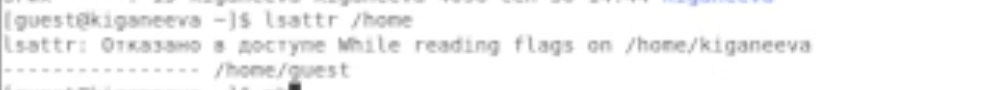{ #fig:009 width=70% }

Расширенные атрибуты других пользователей увидеть не удалось, так как недостаточно прав – отказано в доступе.

10. Создаем в домашней директории поддиректорию dirl командой mkdir dirl (рис. [-@fig:0010])

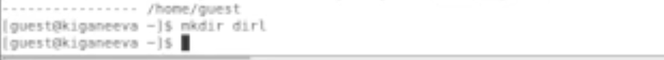{ #fig:0010 width=70% }

Определяем командами ls -l и lsattr, какие права доступа и расширенные атрибуты были выставлены на директорию dirl. (рис. [-@fig:0011])

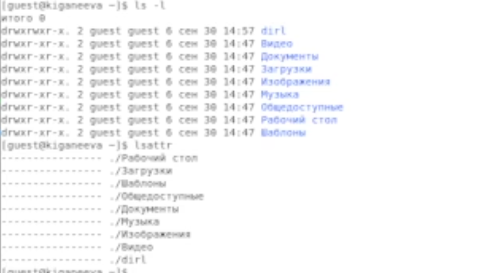{ #fig:0011 width=70% }

11. Снимаем с директории dirl все атрибуты командой chmod 000 dirl
и проверяем её правильность с помощью  выполнения команды ls -l. (рис. [-@fig:0012])

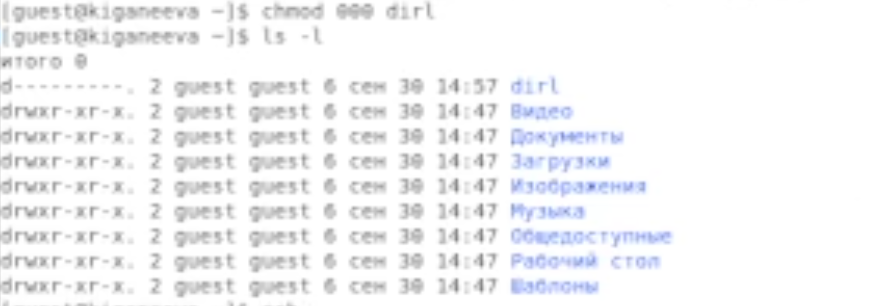{ #fig:0012 width=70% }

Действительно, данная команда сняла все атрибуты с этой директории. Команда ls –l выполняется правильно.

12. Попытались создать в директории dirl файл file1 командой echo "test" > /home/guest/dir1/file1. Увидели, что выполнить данную команду нам не позволяет отсутствие для нас нужных прав. В результате выполнения команды мы не можем производить любые действия над dirl.
Проверили командой ls -l /home/guest/dir1, действительно ли файл file1 не находится внутри директории dirl. (рис. [-@fig:0013])

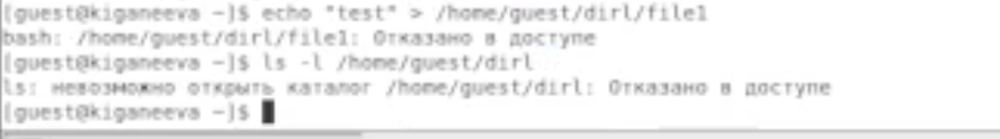{ #fig:0013 width=70% }

13. Заполнили таблицу «Установленные права и разрешённые действия» (см. табл. 2.1), выполняя действия от имени владельца директории (файлов), определив опытным путём, какие операции разрешены, а какие нет. Если операция разрешена, заносили в таблицу знак «+», если не разрешена, знак «-».

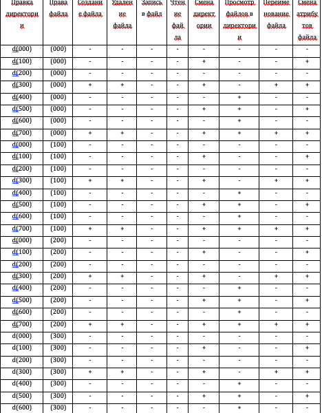{ #fig:0014 width=70% }
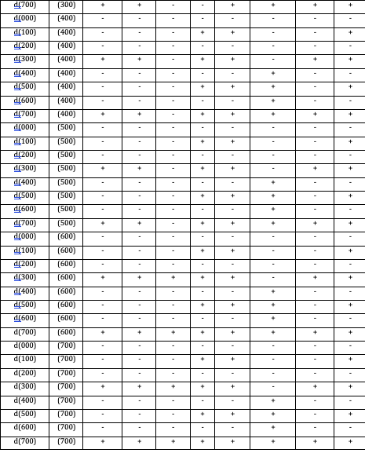{ #fig:0015 width=70% }

14. На основании заполненной таблицы определили те или иные минимально необходимые права для выполнения операций внутри директории dir1, заполнили таблицу 2.2.  

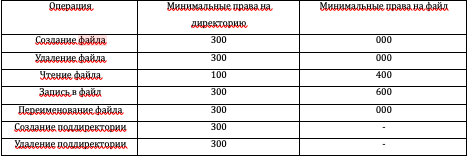{ #fig:0016 width=70% }

# Выводы

В результате выполнения данной лабораторной работы я получила практические навыки работы в консоли с атрибутами файлов, закрепила теоретические основы дискреционного разграничения доступа в современных системах с открытым кодом на базе ОС Linux.

# Список литературы{.unnumbered}

::: {#refs}
:::
