---
# Front matter
lang: ru-RU
title: 'Отчёт по лабораторной работе №1'
subtitle: 'дисциплина: Основы Информационной Безопасности'
author: 'Чистякова Ханна Ильинична'

# Formatting
toc-title: 'Содержание'
toc: true # Table of contents
toc_depth: 2
lof: true # List of figures
lot: true # List of tables
fontsize: 12pt
linestretch: 1.5
papersize: a4paper
documentclass: scrreprt
polyglossia-lang: russian
polyglossia-otherlangs: english
mainfont: Ubuntu
romanfont: Ubuntu
sansfont: Ubuntu
monofont: Ubuntu
mainfontoptions: Ligatures=TeX
romanfontoptions: Ligatures=TeX
sansfontoptions: Ligatures=TeX,Scale=MatchLowercase
monofontoptions: Scale=MatchLowercase
indent: true
pdf-engine: lualatex
header-includes:
  - \linepenalty=10 # the penalty added to the badness of each line within a paragraph (no associated penalty node) Increasing the value makes tex try to have fewer lines in the paragraph.
  - \interlinepenalty=0 # value of the penalty (node) added after each line of a paragraph.
  - \hyphenpenalty=50 # the penalty for line breaking at an automatically inserted hyphen
  - \exhyphenpenalty=50 # the penalty for line breaking at an explicit hyphen
  - \binoppenalty=700 # the penalty for breaking a line at a binary operator
  - \relpenalty=500 # the penalty for breaking a line at a relation
  - \clubpenalty=150 # extra penalty for breaking after first line of a paragraph
  - \widowpenalty=150 # extra penalty for breaking before last line of a paragraph
  - \displaywidowpenalty=50 # extra penalty for breaking before last line before a display math
  - \brokenpenalty=100 # extra penalty for page breaking after a hyphenated line
  - \predisplaypenalty=10000 # penalty for breaking before a display
  - \postdisplaypenalty=0 # penalty for breaking after a display
  - \floatingpenalty = 20000 # penalty for splitting an insertion (can only be split footnote in standard LaTeX)
  - \raggedbottom # or \flushbottom
  - \usepackage{float} # keep figures where there are in the text
  - \floatplacement{figure}{H} # keep figures where there are in the text
---

# Цель работы

Приобретение практических навыков установки операционной системы на виртуальную машину, настройки минимально необходимых для дальнейшей работы сервисов

# Задание

Установить на виртуальную машину VirtualBox (https://www.virtualbox.org/) операционную систему Linux, дистрибутив CentOS.
 

# Выполнение лабораторной работы

1.	Запустить _Virtual Box_, проверить месторасположение каталога для виртуальных машин (рис.1)

	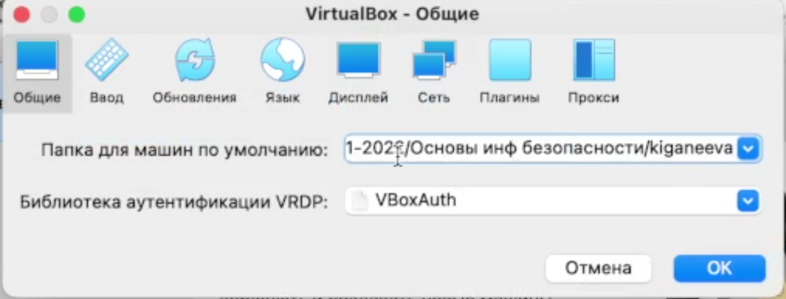{ #fig:001 width=70% }

2.	Создать новую виртуальную машину, задать ей имя _Base_, тип _Linux_, версию _Red Hat_, (рис. 2) размер основной памяти 1024мб (рис. 3), конфигурацию жесткого диска (динамический виртуальный жёсткий диск типа VDI) (рис. 4-5)и его размер – 20Гб.

	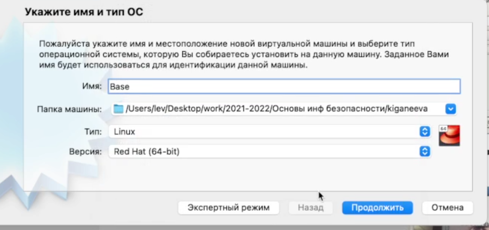{ #fig:001 width=70% }

	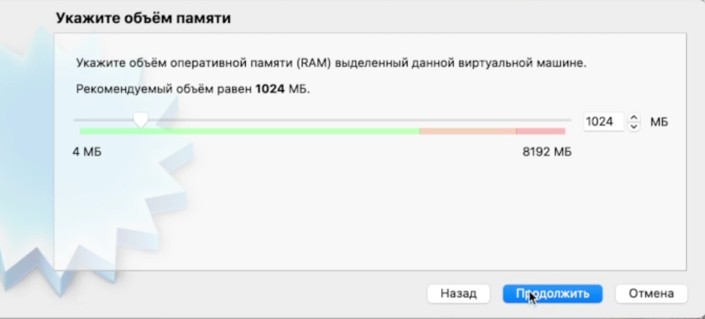{ #fig:001 width=70% }

	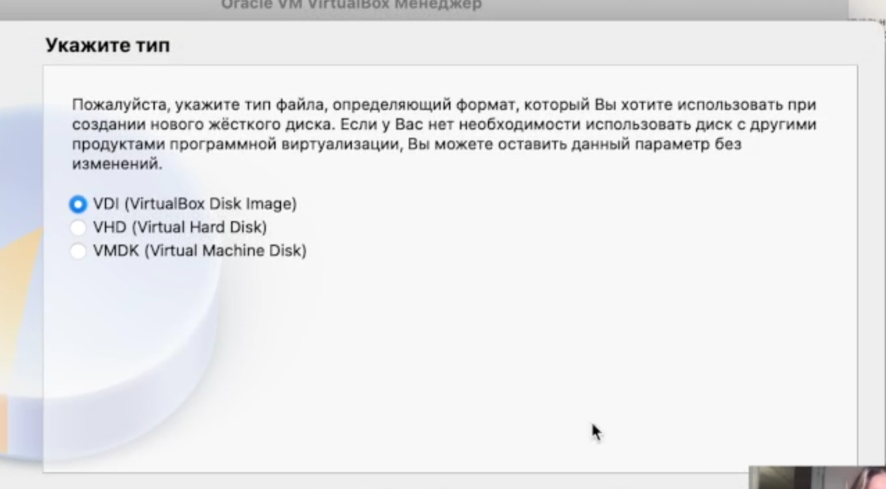{ #fig:001 width=70% }

	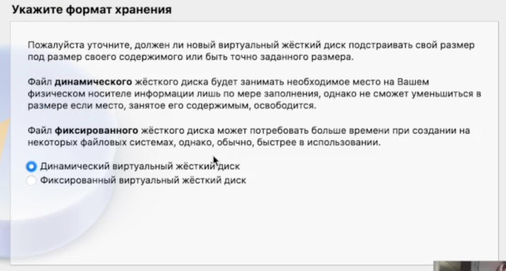{ #fig:001 width=70% }

3.	Проверить, что папка для снимков виртуальной машины имеет путь users/lev/desktop/work/2021-2022/Основы инф. Безопасности/kiganeeva/base/snapshots (рис. 6)

	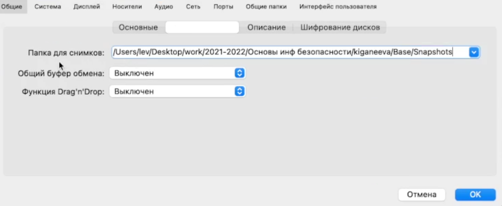{ #fig:001 width=70% }

4.	Добавить новый привод оптических дисков и выбрать образ CentOS-7-x86_64-DVD-1810.iso (рис. 7)

	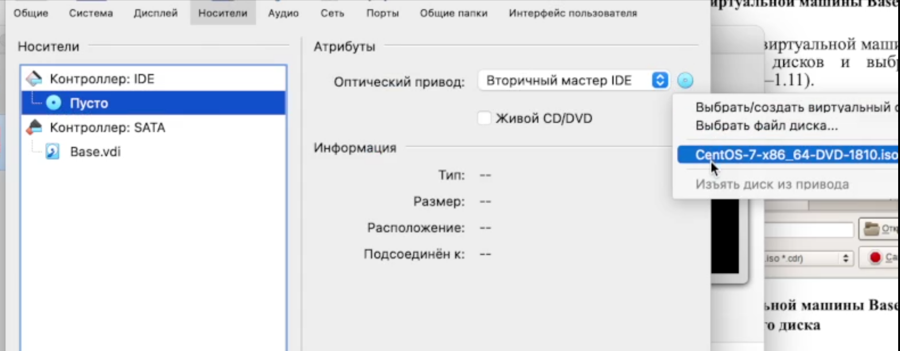{ #fig:001 width=70% }

5.	Запустить виртуальную машину и выставить все настройки – русский язык для интерфейса и раскладки клавиатуры (рис. 8), дату и время (рис. 9), имя сети и т.д. (рис. 10)

	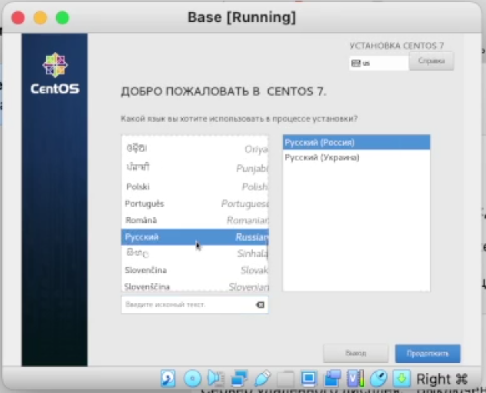{ #fig:001 width=70% }

	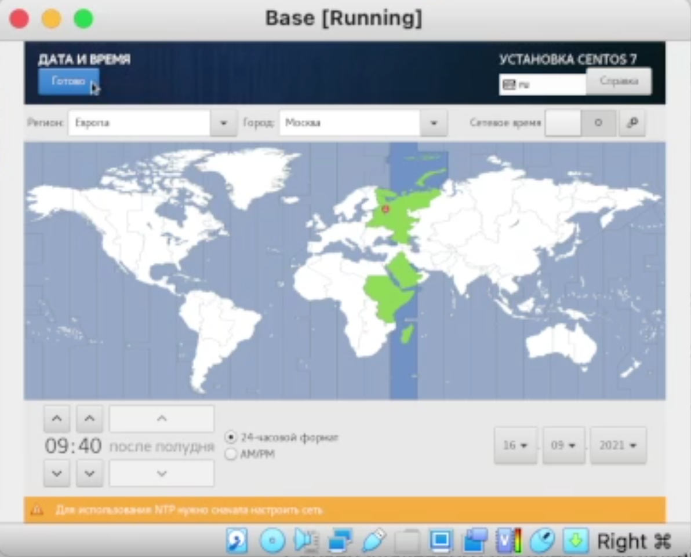{ #fig:001 width=70% }

	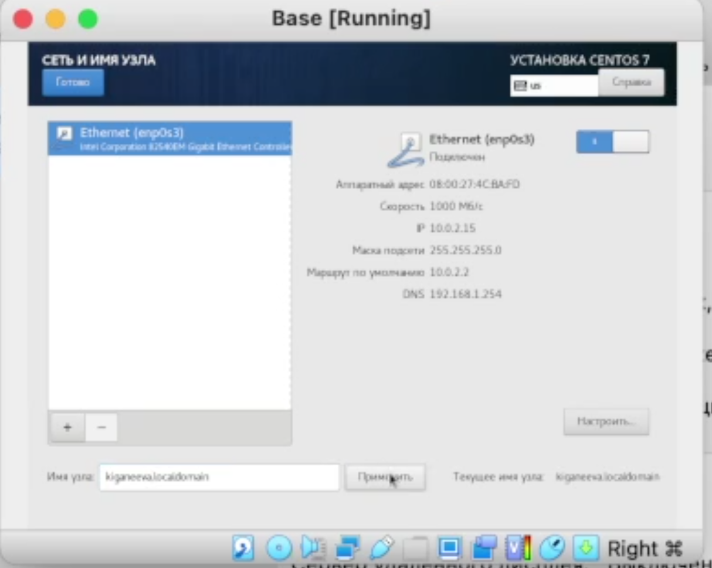{ #fig:001 width=70% }

7.	Установить пароль для root, создать нового пользователя (рис. 11) и завершить установку операционной системы

	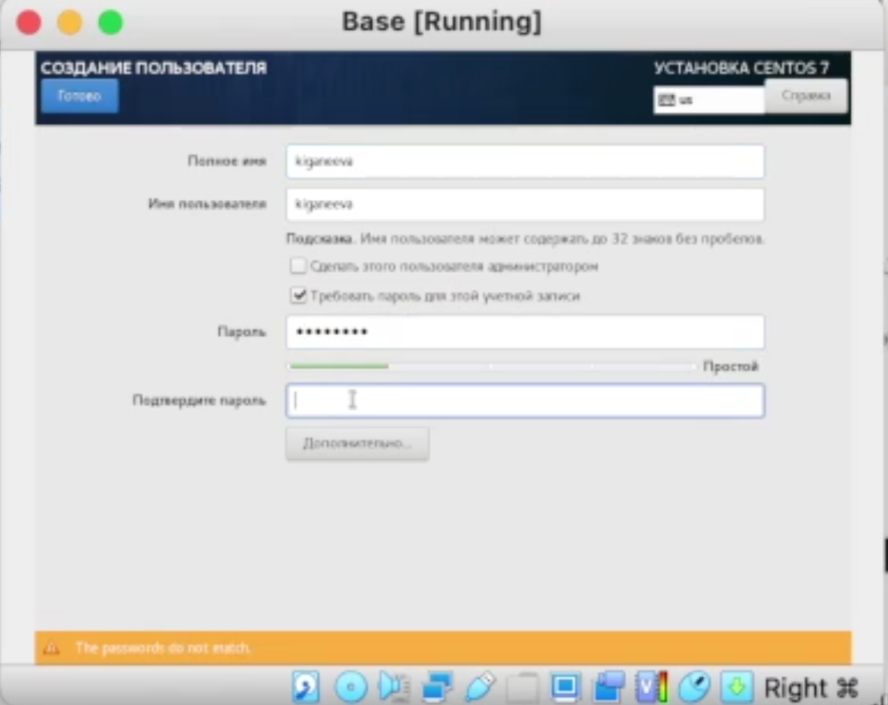{ #fig:001 width=70% }

8.	Подключиться к виртуальной машине с помощью созданной учетной записи (рис. 12)

	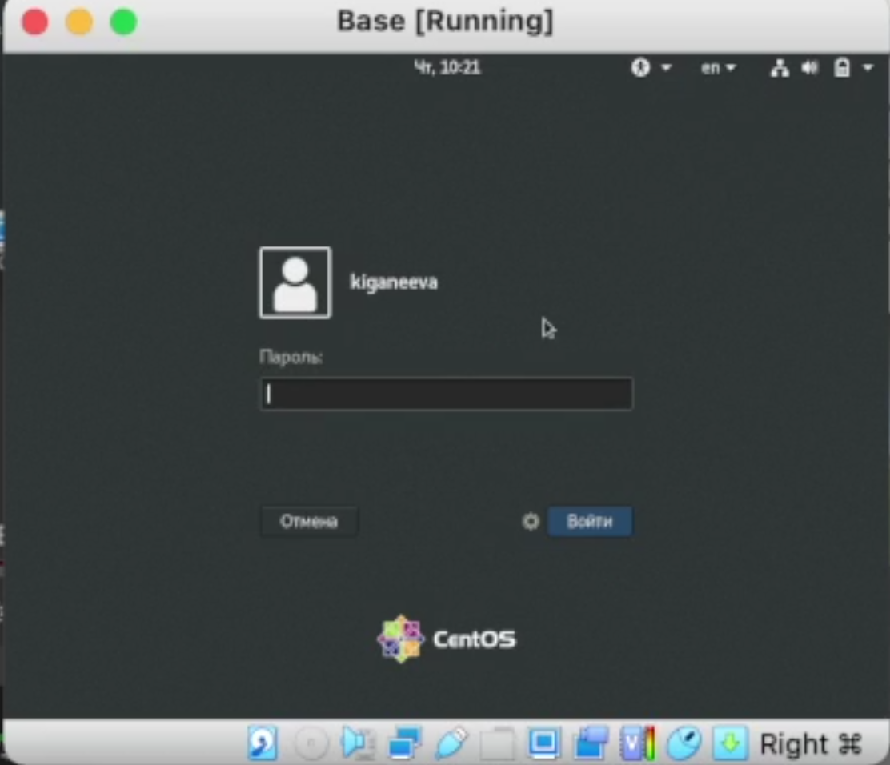{ #fig:001 width=70% }

9.	Запустить терминал, перейти под учетную запись root, обновить системные файлы (рис. 13) и Завершить работу виртуальной машины

	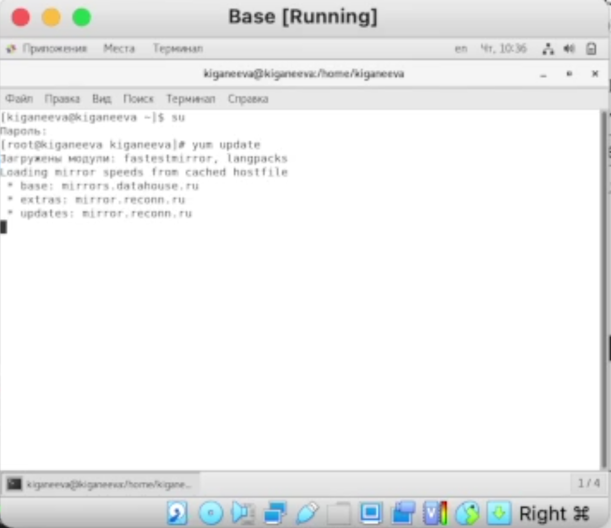{ #fig:001 width=70% }

11.	Создать машину Host 2 на основе виртуальной машины Base (рис. 14-15)

	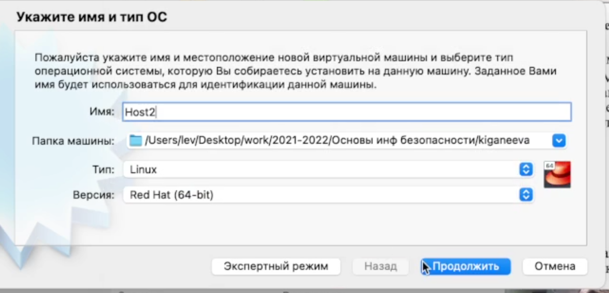{ #fig:001 width=70% }
	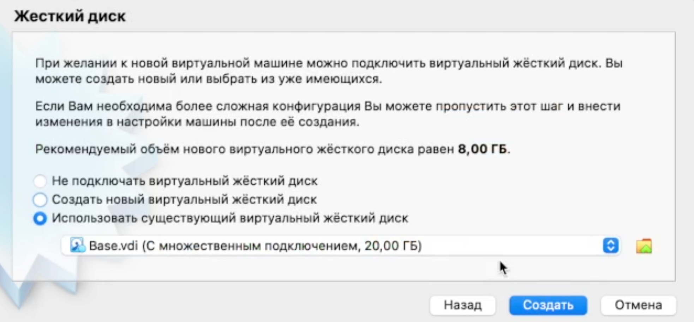{ #fig:001 width=70% }

# Выводы

Я научилась устанавливать операционную систему на виртуальную машину и настраивать минимально необходимые для дальнейшей работы сервисы

::: {#refs}
:::
